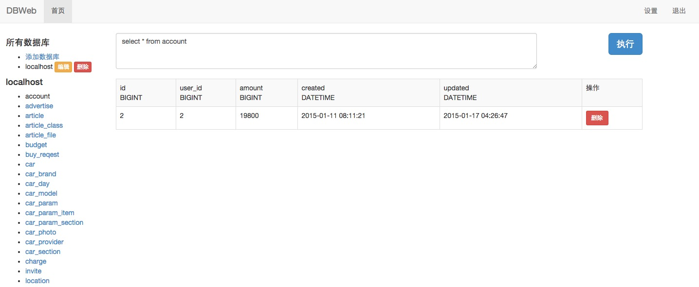

# DBWeb

DBWeb is a web based database admin tool like phpmyadmin. It' written via 
[xorm](http://github.com/go-xorm/xorm), [tango](http://github.com/lunny/tango), [nodb](http://github.com/lunny/nodb).

# Screenshot



# UI Languages

Now support English and 简体中文.

# Database Supports

* MySQL
* PostgreSQL
* sqlite3 : build tag -sqlite3

# Installation

```Go
go get github.com/go-xorm/dbweb
go install github.com/go-xorm/dbweb
```
# Build via make

If you want to embbed the `langs`, `public` and `templats` to the binary, use the below command.
You have to install `make` before this.

```Shell
TAGS="bindata" make generate build
```

Notice: If you want to serve via HTTPS, you still put your *.pem files on the `home` directory.

# Run

```Shell
./dbweb -home=$GOPATH/src/github.com/go-xorm/dbweb/
```

```Shell
./dbweb -help

dbweb version 0.2

  -debug=false: enable debug mode
  -help=false: show help
  -https=false: enable https
  -home=./: set the home dir which contain templates,static,langs,certs
  -port=8989: listen port
```

Then visit http://localhost:8989/

The default user is `admin` and password is also `admin`. You can change it after you logged in.
